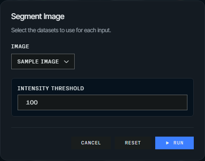
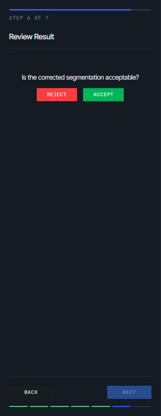
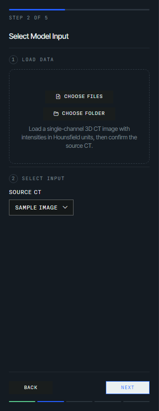
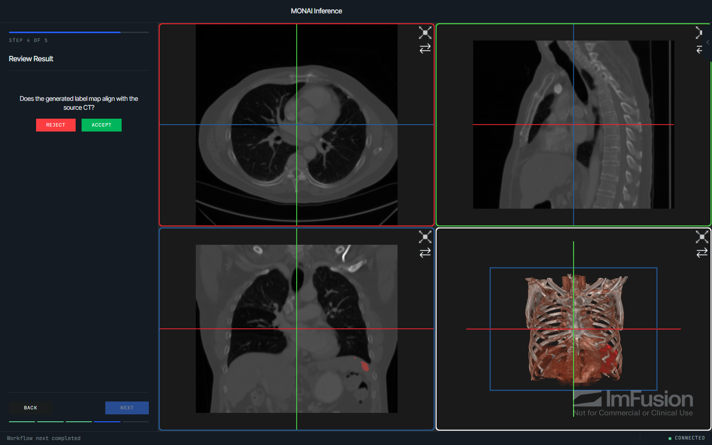
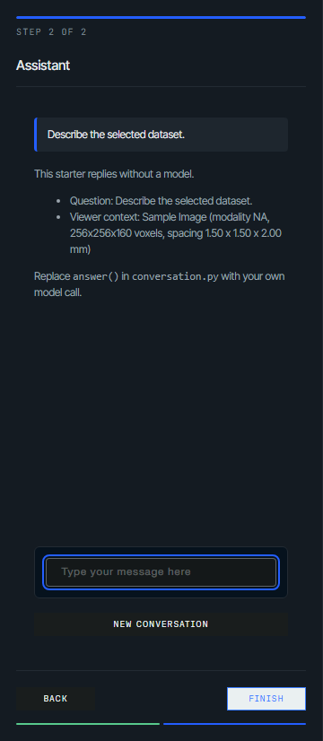

# Command-line setup

The CLI has four commands: `doctor` checks that the local environment can run an
application, `demo` launches a known-good one against a live Python process,
`init` scaffolds a starter project, and `record` writes an application out as
static files you can host with no backend behind them.

## Diagnose the environment

```bash
imfusion-webappkit doctor
```

The command checks:

- the supported Python version and installed WebAppKit distribution;
- the packaged frontend JavaScript and Web SDK WASM bundle;
- ImFusion SDK import, OpenGL initialization, feature modules, and algorithm
  discovery; and
- whether `127.0.0.1:8000` is available.

Use another address when the application will run elsewhere:

```bash
imfusion-webappkit doctor --host 0.0.0.0 --port 8080
```

A failed check returns a non-zero exit code and includes a suggested next step.
License validity cannot always be established without executing a licensed
algorithm, so the command complements rather than replaces an application
smoke test.

## Launch the bundled demo

```bash
imfusion-webappkit demo
```

This starts the packaged `webapp_demo` with a small bundled NIfTI image and
opens <http://127.0.0.1:8000>. It demonstrates parameterized actions, progress,
sample data, application information, and export.

```bash
imfusion-webappkit demo --workflow
```

This starts the packaged `workflow_demo` guided workflow instead.

Options:

```bash
imfusion-webappkit demo --host 0.0.0.0 --port 8080
imfusion-webappkit demo --no-open
imfusion-webappkit demo --workflow --no-open
```

## Record a static demo

```bash
imfusion-webappkit record demos/threshold.py -o dist/threshold
```

This drives an application once while building and writes a directory that any
static host can serve, with no Python behind it. `demo` runs an application;
`record` publishes one. See [Recorded static
demos](guides/static-demos.md) for what can be recorded and how to describe it.

Options:

```bash
imfusion-webappkit record my_demos.showcase:spec -o dist/showcase
imfusion-webappkit record demos/threshold.py -o dist/threshold --title "Image Tools"
imfusion-webappkit record demos/threshold.py -o dist/threshold --skip-client-build
```

## Create a starter project

```bash
imfusion-webappkit init my-demo --theme gray
```

The generated project contains:

```text
my-demo/
  .claude/
    skills/
      work-with-imfusion-images/
        SKILL.md
  .cursor/
    skills/
      work-with-imfusion-images/
        SKILL.md
  AGENTS.md
  CLAUDE.md
  app.py
  algorithm.py
  pyproject.toml
  README.md
```

The default `--template simple` starter is a button, the parameters you
declared, and your function behind them, with the application configuration
kept separate from the processing function and a browser-editable intensity
threshold standing in for it. `AGENTS.md`, `CLAUDE.md`, and the Cursor and
Claude Code project skills give coding agents the non-obvious session,
threading, image-value, and geometry conventions, and the MONAI starter adds a
model-integration skill on top. To run it:

```bash
cd my-demo
uv sync
uv run python app.py
```

The registered action collects the declared parameter and the selected input:



When `init` runs from an editable WebAppKit source checkout, the generated
`pyproject.toml` automatically points uv at that checkout. Released
installations use the normal `imfusion-webappkit` package dependency.

The generated `app.py` uses the `DARK` theme unless `--theme gray` or
`--theme light` is passed. `--title` still sets the browser title; otherwise
it is derived from the destination name.

Create a guided load, configure, process, review, and export workflow instead:

```bash
imfusion-webappkit init my-workflow --template workflow
```

The workflow template uses the same `app.py` and `algorithm.py` separation, but
connects the processing callback to `MessageStep`, `InputSelectionStep`,
`ParameterStep`, `ProcessingStep`, `ValidationStep`, and `ExportStep`.



Create a direct PyTorch/MONAI model-inference example instead:

```bash
imfusion-webappkit init monai-demo --template monai
```

The MONAI template demonstrates conversion between ImFusion and MONAI image
layouts, geometry-aware preprocessing and postprocessing, sliding-window
inference, and publication of an aligned label map. It starts with a concrete
Model Zoo bundle that can be replaced with another compatible model. The pinned
bundle is downloaded automatically on first use into MONAI's shared per-user
cache. MONAI and PyTorch are dependencies of the generated project, not
WebAppKit itself.

Its workflow contains introduction and loading steps, an explicit
`InputSelectionStep`, manually triggered processing, review, and export.



Inference starts only after the user chooses the source volume and clicks
**Run Segmentation**, so repeat runs remain tied to the source rather than a
previously generated label map.



Create a conversational assistant prototype instead:

```bash
imfusion-webappkit init imaging-assistant --template chat
```

The chat template answers questions about the datasets selected in the viewer
using a `CustomStep` panel, with a placeholder reply function and no model
provider dependency. Replace `answer()` in `conversation.py` with your own
model call. Replies run on the shared ImFusion owner thread, so give network
clients a short timeout; the panel is not streaming, and the transcript lives
only in the browser session.



The command refuses to replace existing template files unless `--force` is
provided. It never removes unrelated files from the destination.

All commands can also be invoked through the module entry point, for example:

```bash
python -m imfusion_webappkit doctor
python -m imfusion_webappkit init my-demo --template workflow
```
