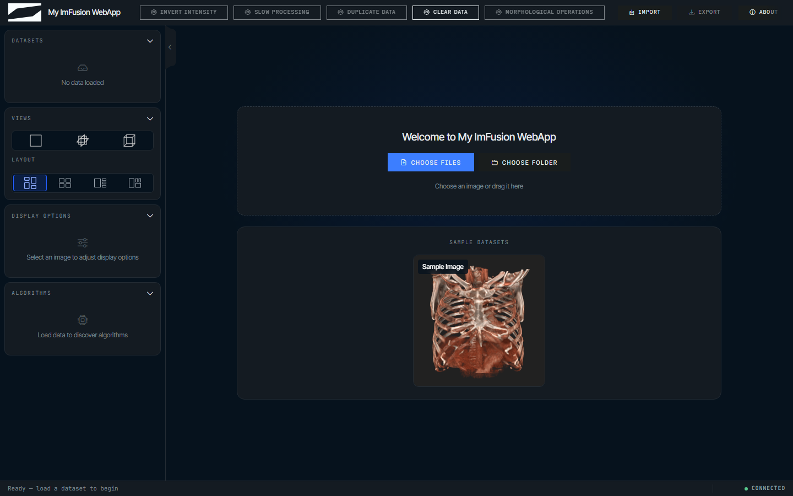
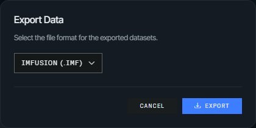

# Getting started

The fastest way to see the kit is to run the bundled demo, then scaffold a
project from a template. Both assume Python 3.10 or newer,
[uv](https://docs.astral.sh/uv/), access to the ImFusion package index, and
valid ImFusion Suite and Web SDK licenses.

## Run the bundled demo

From a source checkout:

```bash
uv sync
uv run imfusion-webappkit demo
```

That starts the packaged demo with a small bundled NIfTI image at
<http://127.0.0.1:8000>. Add `--workflow` to launch the guided, multi-step demo
instead.



The checkout includes the compiled browser client, so Node.js and npm are not
needed to run it. The ImFusion package index is already configured in
`pyproject.toml`, which is why `uv sync` resolves the SDK without further
arguments.

You can also start the same demo as a Python module:

```bash
uv run python imfusion_webappkit/examples/webapp_demo.py
```

`ImFusionWebApp.run()` binds to `localhost` by default, while the CLI demo and
the generated templates bind explicitly to `127.0.0.1`, so use whichever address
the command you started prints.

## Install a release

Releases are published to PyPI, while the ImFusion SDK they depend on stays on
the ImFusion package index, so an install outside a checkout has to name both:

```bash
uv pip install imfusion-webappkit --extra-index-url https://pypi.imfusion.com/simple
imfusion-webappkit demo
```

In a `uv` project, declaring the index in `pyproject.toml` is easier than
repeating it on every command:

```toml
[[tool.uv.index]]
name = "imfusion"
url = "https://pypi.imfusion.com/simple"

[tool.uv.sources]
imfusion-sdk = { index = "imfusion" }
imfusion-sdk-dicom = { index = "imfusion" }
imfusion-sdk-registration = { index = "imfusion" }
```

The wheel includes the compiled browser client, so installing and running a
release does not require Node.js or npm.

## Start your own

```bash
uv run imfusion-webappkit init my-demo
cd my-demo
uv sync
uv run python app.py
```

The generated project runs as soon as it is created, with `app.py` holding the
application, `algorithm.py` the processing function you replace, and `AGENTS.md`
the session, threading, and geometry conventions that coding agents need.

The default template exposes a single action, while `--template workflow`,
`--template monai`, and `--template chat` pick the other shapes, and
`--theme gray` selects the gray theme instead of the default dark one. The
[command-line setup](cli.md) page lists the flags and what each template writes.

When `init` runs from an editable WebAppKit source checkout, the generated
`pyproject.toml` points uv at that checkout. Released installations use the
normal `imfusion-webappkit` package dependency.

## Sessions, export, and sample data

Each browser connection gets an isolated `WebApplicationController`, data model,
job state, and optional workflow, and the `app` argument injected into a
callback is that controller rather than the server host. Add seed data to
`webapp.initial_data` before `run()` when every new browser session should start
with the same datasets.

The header export button supports IMF, NIfTI (`.nii.gz`), and DICOM by default.



Restrict it with the application-level `export_formats` option:

```python
webapp = ImFusionWebApp(
    show_export_button=True,
    export_formats=["imf", "nii.gz"],
)
```

## Add sample datasets

Offer datasets on the empty viewer's landing page so demos and tests can load
them with one click:

```python
from imfusion_webappkit import ImFusionWebApp, SampleDataset

webapp = ImFusionWebApp(
    sample_datasets=[
        SampleDataset("CT", "samples/ct.imf", "samples/ct-preview.png"),
        SampleDataset("MR", "samples/mr.nii.gz"),
    ]
)
```


Dataset and thumbnail paths may be absolute or relative to the process working
directory. A thumbnail is optional; without one, the card shows the dataset
name centered in the square. Files are validated when the application is
created and served to the browser only through dedicated sample-dataset URLs.

## Develop the browser client

To modify or rebuild the client, install Node.js 18 or newer and see
[Development](development.md) for hot reload and test commands.
