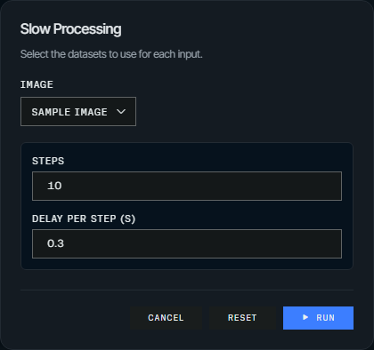
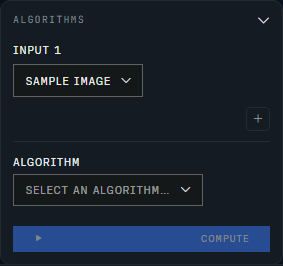
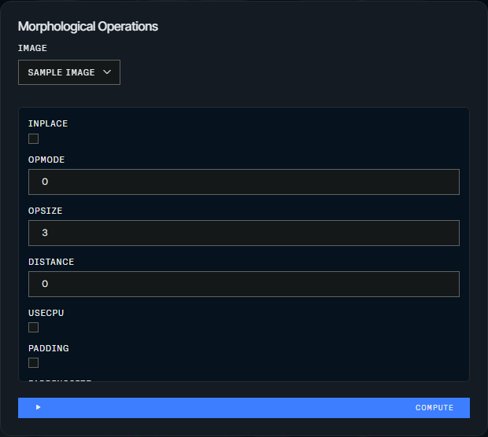

# Actions and algorithms

An action is a Python function with the name you want on the button, and the kit
builds the matching controls from its argument types and runs the call on the
ImFusion SDK thread. Whatever the function returns shows up in the viewer, and
an existing ImFusion algorithm can be exposed the same way, by name.

## Add an action

The callback signature determines what the application passes to it:

```python
import imfusion

from imfusion_webappkit import WebApplicationController


# Receive the selected image.
@app.register("Process")
def process(imageset: imfusion.SharedImageSet) -> imfusion.SharedImageSet:
    return imageset


# Receive the selected image and active application.
@app.register("Process with progress")
def process_with_progress(
    imageset: imfusion.SharedImageSet,
    app: WebApplicationController,
) -> imfusion.SharedImageSet:
    app.update_progress(0.5, "Halfway done")
    return imageset


# Run without a selected image.
@app.register("Clear all")
def clear_all(app: WebApplicationController) -> None:
    app.data_model.clear()
```

The name `app` is reserved for application access. A callback may otherwise use
any name for its single positional data argument; `image` and `imageset` are
only conventional examples. Action names must be unique.

For an existing or imported callable, use the direct form without creating a
forwarding wrapper:

```python
app.register("Imported operation", imported_operation)
```

Returned data is added to the synchronized data model. After modifying existing
data in place, return it or call `app.data_model.update(index)`.

SDK algorithms can be registered for both Suite and WebApp with stacked
decorators:

```python
import imfusion


@app.register("Segment")
@imfusion.algorithm.register(display_name="Segment")
class Segment:
    image = imfusion.algorithm.Input(imfusion.SharedImageSet)
    threshold = imfusion.algorithm.ParamDouble("Threshold", default=0.5)

    def __call__(self):
        return run_segmentation(self.image, threshold=self.threshold)
```

The inner SDK decorator registers the algorithm and defines its Suite lifecycle.
The outer WebApp decorator exposes the same algorithm through the SDK algorithm
registry, preserving its compatibility checks and complete parameter metadata.
Portable algorithms do not receive the session-scoped `app` argument; use a
function action when direct WebApp access is required.

## Add user-editable parameters

Declare typed parameters to generate a configuration dialog without creating a
full workflow. Parameter values are validated by the server and passed to the
callback as keyword arguments:

```python
from imfusion_webappkit import (
    BoolParameter,
    ChoiceParameter,
    FloatParameter,
    IntParameter,
)


@app.register(
    "Segment",
    parameters=[
        FloatParameter(
            "threshold",
            label="Confidence threshold",
            default=0.5,
            minimum=0.0,
            maximum=1.0,
            step=0.05,
        ),
        ChoiceParameter(
            "model",
            options=["Fast", "Accurate"],
            default="Fast",
        ),
        BoolParameter("postprocess", default=True),
    ],
)
def segment(image, *, threshold, model, postprocess, app):
    app.update_progress(0.2, "Running inference")
    return run_segmentation(
        image,
        threshold=threshold,
        model=model,
        postprocess=postprocess,
    )
```



Available descriptors are `BoolParameter`, `IntParameter`, `FloatParameter`,
`StringParameter`, and `ChoiceParameter`. Numeric parameters support
`minimum`, `maximum`, `step`, and `unit`; every parameter can provide a display
`label` and `description`. The dialog remembers values for the current browser
session and provides a reset button.

Parameterized actions can also use named inputs. App-only callbacks can expose
parameters without requiring a selected dataset:

```python
@app.register(
    "Generate phantom",
    parameters=[IntParameter("size", default=128, minimum=32, maximum=512)],
)
def generate_phantom(*, size, app):
    app.data_model.add(create_phantom(size), "Phantom")
```

## Use named inputs

For operations such as registration, declare multiple named inputs. The browser
renders one dataset selector per input, and the callback receives a dictionary
keyed by the input names:

```python
import imfusion

from imfusion_webappkit import InputSpec


@app.register(
    "Register images",
    inputs=[
        InputSpec("fixed", "Fixed image"),
        InputSpec("moving", "Moving image"),
    ],
    result_input="moving",
)
def register(inputs, app):
    fixed = inputs["fixed"]
    moving = inputs["moving"]
    algorithm = imfusion.registration.ImageRegistrationAlgorithm(fixed, moving)
    algorithm()
    return imfusion.registration.apply_deformation(moving)
```

`InputSpec.required` controls whether an input must be selected.
`result_input` identifies the input to use when an operation modifies data in
place and has no explicit return value.

## Expose ImFusion algorithms

Enable a generic panel that discovers algorithms compatible with the selected
image when constructing the application:

```python
app = ImFusionWebApp(algorithm_selector="sidebar")
```



To show an Algorithms button alongside the other header actions instead:

```python
app = ImFusionWebApp(algorithm_selector="header")
```

Or expose one algorithm as a dedicated control:

```python
app.register(
    "Morphology",
    algorithm="Base.MorphologicalOperations",
    placement="header",
)
```



Dedicated controls also accept `placement="sidebar"` (the default) or
`placement="header"`.

The algorithm ID must match an entry from
`imfusion.algorithm.list_available()`.

Algorithm panels support the same named-input contract. ImFusion receives
the datasets in declaration order:

```python
app.register(
    "Registration",
    algorithm="Reg.ImageRegistration",
    inputs=[
        InputSpec("fixed", "Fixed image"),
        InputSpec("moving", "Moving image"),
    ],
    result_input="moving",
)
```

Python algorithms decorated with `@imfusion.algorithm.register` can also be
passed directly or exposed with the stacked-decorator form shown above. See
`imfusion_webappkit/examples/registration_demo.py` for a complete multi-input
example.

Data actions must declare at least one required input. Optional secondary inputs
are supported, but an all-optional schema is rejected because it is ambiguous
with an app-only action.

## Session controller and jobs

The `app` callback argument is a session-scoped
`WebApplicationController`. It provides `data_model`, `selected_data`,
`select_data`, `open`, `execute_algorithm`, `close_all`, and
`update_progress`, as well as `publish_results` for explicit output
publication. It also exposes `session_id`, the optional `workflow`, and
`cancellation_requested`. Progress updates are published only while the session
has an active correlated job. See the
[application API reference](../api/application.md) for the complete surface.

Actions, algorithm discovery, algorithm execution, dedicated controllers, and
manual workflow runs and navigation use one correlated job protocol. Automatic
workflow processing during initial startup and workflow step-data updates still
run on the SDK owner thread, but do not create their own jobs. A browser session
can have one in-flight job. ImFusion work is globally serialized on the SDK
owner thread until the SDK explicitly guarantees broader thread safety.

Queued jobs can be cancelled immediately. A running native operation cannot be
interrupted generically by the Python SDK. Cancellation is recorded and
automatic publication of returned outputs is suppressed when possible.
In-place mutations and arbitrary callback side effects cannot be rolled back,
so long callbacks should check `app.cancellation_requested` before committing
those effects. The UI reports that native computation may continue.
