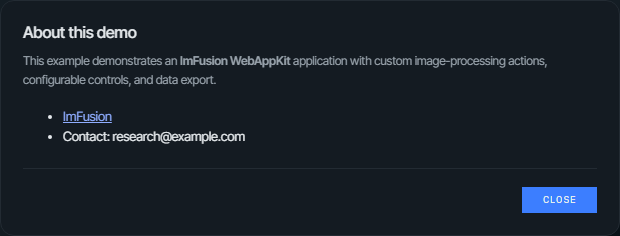
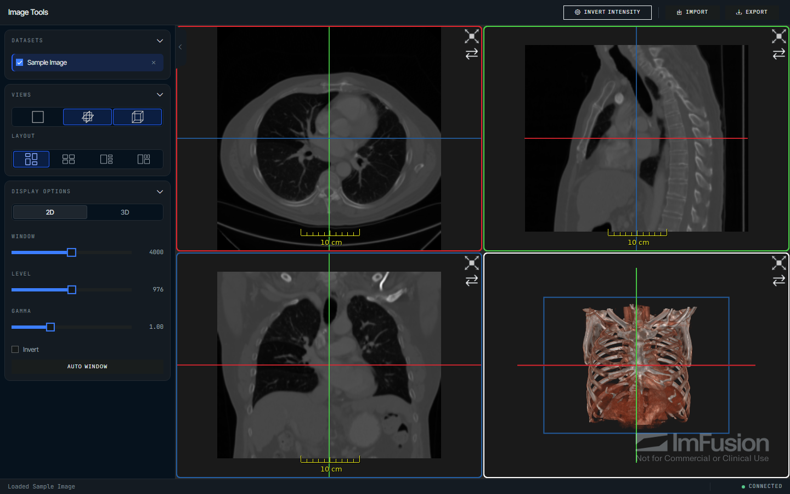
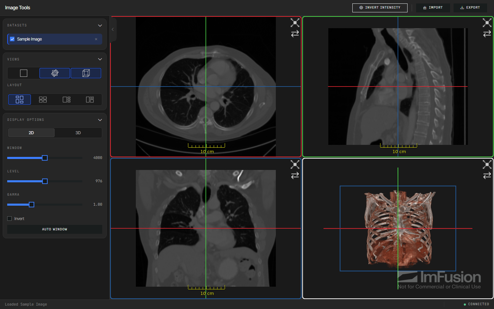
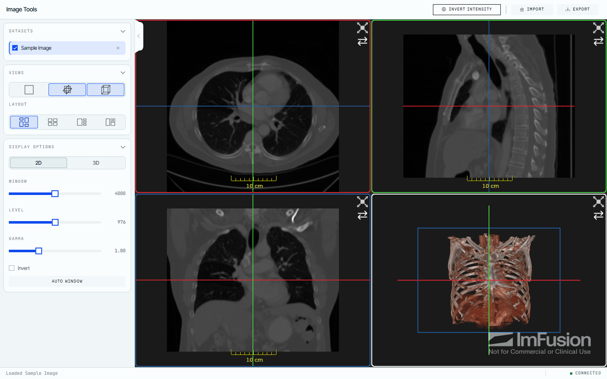
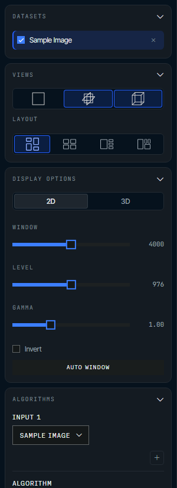

# Branding, themes, and layout

Logo, colors, panel widths, an About dialog, and the empty-state landing page
are configured from Python, and so is the viewer layout, so a deployment can be
rebranded without touching the browser client.

## Branding

Use local image files for the header logo and browser favicon, and customize the
initial file-loading screen:

```python
from imfusion_webappkit import BrandingConfig, ImFusionWebApp


webapp = ImFusionWebApp(
    title="Spine Planner",
    branding=BrandingConfig(
        logo="assets/company-logo.svg",
        favicon="assets/favicon.ico",
        landing_page_title="Welcome to Spine Planner",
        landing_page_message="Choose a scan or drag it here",
    ),
)
```


Relative asset paths are resolved from the process working directory. `title`
remains the browser tab title and is used as the logo's accessible alternative
text.

## Information dialog

Add a generic information button to the application header with `InfoConfig`.
Its content supports Markdown, making it suitable for project descriptions,
instructions, contact details, citations, and links:

```python
from imfusion_webappkit import ImFusionWebApp, InfoConfig


webapp = ImFusionWebApp(
    info=InfoConfig(
        button_label="About",
        title="About this demo",
        content="""
This demo presents our **image segmentation algorithm**.

- [Read the paper](https://example.com/paper)
- Contact: research@example.edu
""",
    )
)
```



Leave `info` unset to omit the button. The Markdown is rendered without raw
HTML support.

## Theme

Choose one of the built-in `DARK`, `GRAY`, or `LIGHT` presets and override only
the semantic values needed by the application:

```python
from imfusion_webappkit import ImFusionWebApp, ThemeConfig, ThemePreset


webapp = ImFusionWebApp(
    theme=ThemeConfig(
        preset=ThemePreset.LIGHT,
        primary="#005f73",
        primary_hover="#004c5c",
        font_family="Inter, system-ui, sans-serif",
    ),
)
```

The presets differ in their backgrounds, surfaces, text, and status colors. The
default `DARK` preset tints its chrome towards the brand blue, `GRAY` keeps the
same surface steps in neutral grey so the accent is the only color on the page,
and `LIGHT` inverts both. Starter projects from `imfusion-webappkit init` use
`DARK` unless `--theme` selects another preset:







Theme overrides include primary and secondary colors, backgrounds and surfaces,
text colors, border and status colors, and the font family.

## Sidebar

`SidebarConfig` controls the standard viewer panels:

```python
from imfusion_webappkit import SidebarConfig


sidebar = SidebarConfig(
    show_datamodel=True,
    show_views=True,
    show_display_options=False,
    collapsed=False,
)
```



Pass `sidebar=None` to hide the sidebar. Set
`algorithm_selector="sidebar"` on `ImFusionWebApp` to show the Algorithms panel,
or use `"header"` to expose it as a header button. Dedicated algorithms exposed
with `app.register(..., algorithm=..., placement=...)` support the same options.

## Page and viewer layout

Configure panel placement and width, status-bar visibility, and the initial Web
SDK view arrangement:

```python
from imfusion_webappkit import (
    ImFusionWebApp,
    LayoutConfig,
    SidebarConfig,
    SidePosition,
    TitlePosition,
    ViewLayout,
    ViewType,
)


webapp = ImFusionWebApp(
    sidebar=SidebarConfig(),
    layout=LayoutConfig(
        header_title_position=TitlePosition.CENTER,
        header_logo_position=SidePosition.LEFT,
        sidebar_position=SidePosition.RIGHT,
        sidebar_width=280,
        sidebar_resizable=True,
        workflow_panel_position=SidePosition.LEFT,
        workflow_panel_width=320,
        workflow_panel_resizable=False,
        show_status_bar=False,
        initial_view_layout=ViewLayout.FOCUS_PLUS_ROWS,
        initial_visible_views=(ViewType.TWO_D, ViewType.MPR, ViewType.THREE_D),
    ),
)
```

The header always displays the application title, including when a branding
logo is configured. The title defaults to `left` and can also be positioned at
`center` or `right`; the logo defaults to `left` and can be positioned at
`right`. Panel positions are `left` or `right`; widths must be between 180 and
640 pixels.

The sidebar and the workflow panel are resizable by default, which makes their
configured width the initial width only: users can drag the inner edge of a
panel to resize it within the same 180–640 pixel range, double-click the edge to
restore the configured width, or use the arrow keys once the handle is focused.
Growing a panel additionally stops once the viewer area would shrink below 240
pixels, and widths are not persisted across page reloads. Set
`sidebar_resizable=False` or `workflow_panel_resizable=False` to pin a panel to
its configured width.

Supported initial view layouts are `Auto`, `Rows`, `FocusPlusStack`, and
`FocusPlusRows`. Visible views may contain `2d`, `mpr`, `axial`, `coronal`,
`sagittal`, and `3d`. `mpr` enables all three orthogonal MPR views together.
Leave either initial viewer option unset to retain the Web SDK default.
Plain string values are also accepted and normalized to the corresponding enum.
