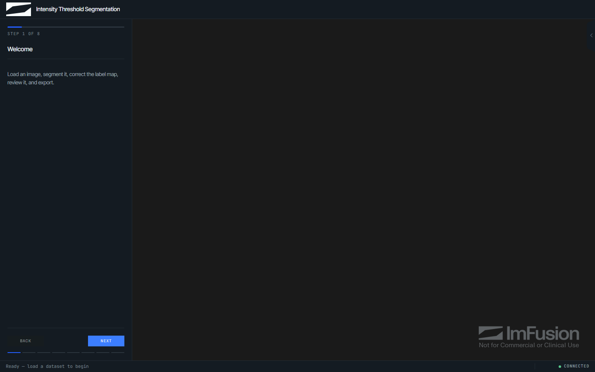
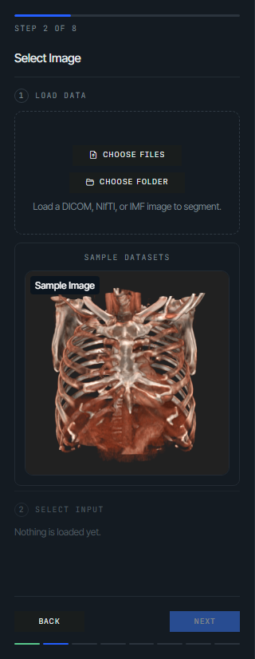
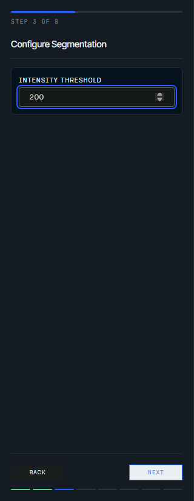
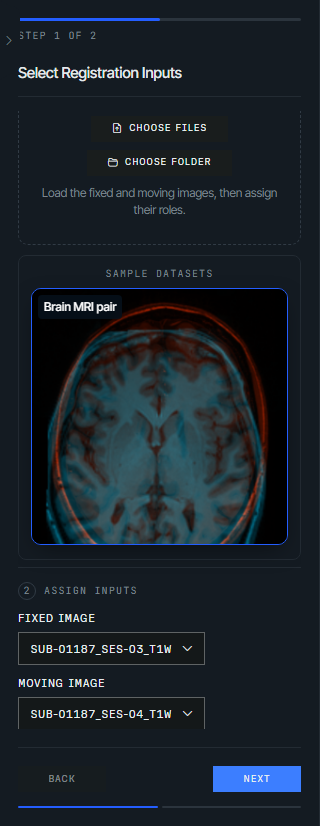
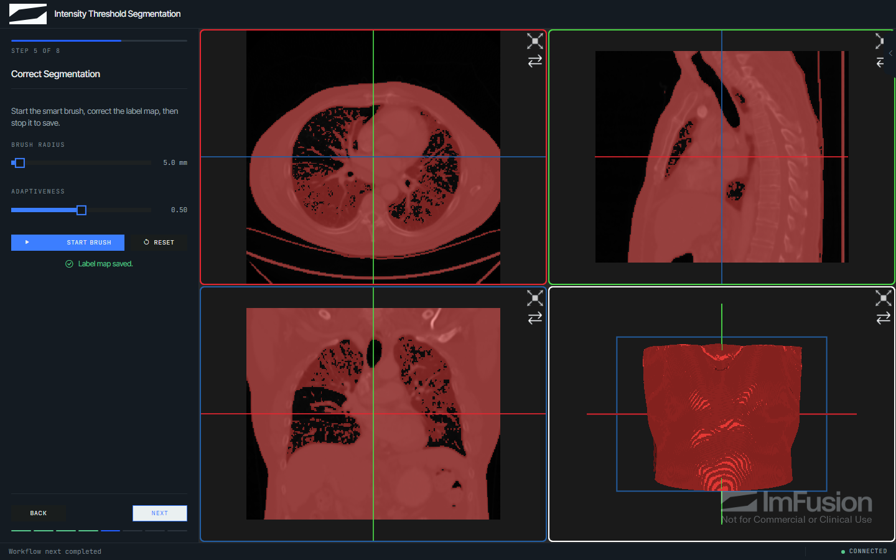
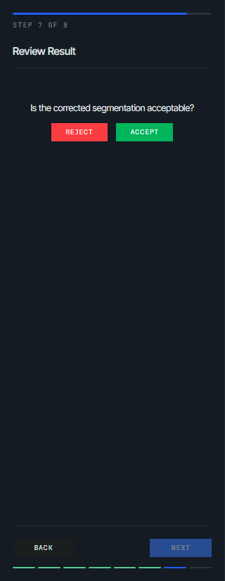
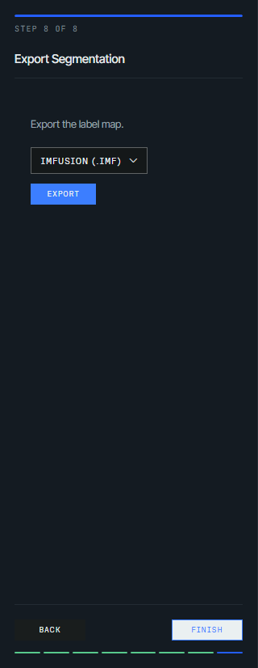
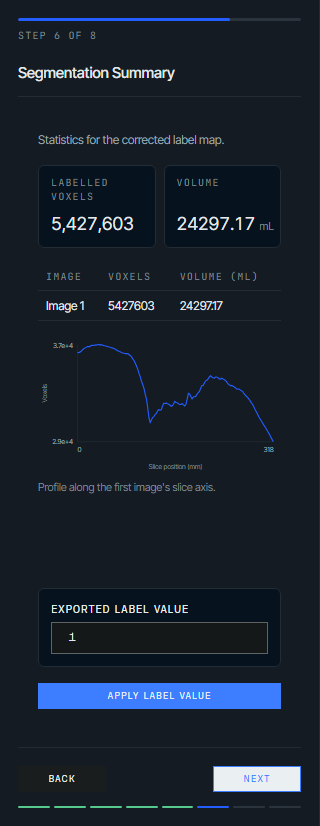
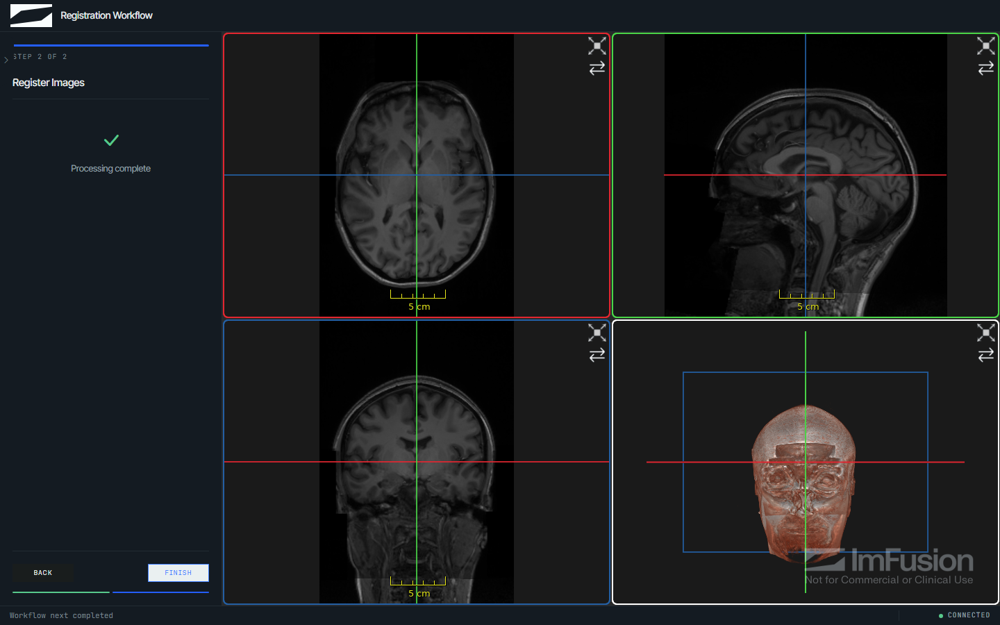

# Guided workflows

If a study has to run in a fixed order, define a workflow as a list of steps.
The kit handles the UI and keeps state per session, including progress and
cancellation, so a reviewer can reject a result and step back to an earlier
step without restarting the session.

A workflow uses the same session controller, viewer, data model, and operation
runtime as regular actions, and its factory is called once per browser session
rather than once for the server.

## Create a workflow

```python
from imfusion_webappkit import (
    ExportStep,
    ImFusionWebApp,
    InputSelectionStep,
    InputSpec,
    MessageStep,
    Workflow,
)


def create_workflow(app):
    return Workflow(
        app,
        steps=[
            MessageStep("Welcome", "Load and review an image."),
            InputSelectionStep("Select image", inputs=[InputSpec("image", "Image")]),
            ExportStep(formats=["imf"]),
        ],
    )


webapp = ImFusionWebApp(
    title="Review workflow",
    show_load_button=False,
    show_export_button=False,
)
webapp.set_workflow(create_workflow)
webapp.run()
```

The workflow panel shows the step title, its contents, and the navigation and
progress shared by every step:



The factory's `app` argument is the session-scoped
`WebApplicationController`. Steps do not receive an internal `Session`.

## Available steps

| Step | Purpose |
| --- | --- |
| [`MessageStep`](../api/workflows.md#imfusion_webappkit.workflow.MessageStep) | Show instructional text |
| [`InputSelectionStep`](../api/workflows.md#imfusion_webappkit.workflow.InputSelectionStep) | Load datasets and assign them to named roles |
| [`ParameterStep`](../api/workflows.md#imfusion_webappkit.workflow.ParameterStep) | Collect typed parameter values |
| [`ProcessingStep`](../api/workflows.md#imfusion_webappkit.workflow.ProcessingStep) | Run a callback and publish results |
| [`BrushStep`](../api/workflows.md#imfusion_webappkit.workflow.BrushStep) | Edit a label map with the smart brush |
| [`AnnotationStep`](annotations.md) | Collect points, lines, boxes, or angles from the user |
| [`ValidationStep`](../api/workflows.md#imfusion_webappkit.workflow.ValidationStep) | Accept or reject a result before continuing |
| [`ExportStep`](../api/workflows.md#imfusion_webappkit.workflow.ExportStep) | Export session data in chosen formats |
| [`CustomStep`](../api/workflows.md#imfusion_webappkit.workflow.CustomStep) | Compose custom panel content from UI elements |

See the [workflow API reference](../api/workflows.md) for constructors and options.

There is no built-in chat step: `--template chat` ships `ConversationStep`, a
`CustomStep` subclass whose transcript and model call live in the generated
project rather than in the kit, as described under
[Command-line setup](../cli.md#create-a-starter-project).

`InputSelectionStep` is the entry point of every workflow that processes data:
it both loads datasets and assigns them to the roles later steps consume. It
displays one selector per `InputSpec`. Set `allow_upload=False` when users must
choose only from data that is already in the session.

Any `sample_datasets` configured on the app are offered in the step as well;
they follow `allow_upload` unless `allow_sample_datasets` says otherwise.



Roles reference datasets directly. If an assigned dataset leaves the session,
the role is cleared and the step blocks until it is reassigned.

While the step is active, loading data assigns it automatically. A step with a
single role always follows the newest dataset, so loading another image replaces
the previous choice. A step with several roles fills the unassigned required
roles in declaration order. Assignment also drives the viewer: only the assigned
datasets stay visible, which keeps the display and the workflow inputs in
agreement.

`ParameterStep` declares user-editable values using the same
`BoolParameter`, `IntParameter`, `FloatParameter`, `StringParameter`, and
`ChoiceParameter` classes as [action parameters](actions-and-algorithms.md#add-user-editable-parameters):

```python
from imfusion_webappkit import FloatParameter, ParameterStep


ParameterStep(
    "Configure",
    parameters=[
        FloatParameter(
            "threshold",
            label="Intensity threshold",
            default=100.0,
            minimum=-1000.0,
            maximum=4096.0,
            step=1.0,
        ),
    ],
    step_id="configure",
)
```



Values are validated the same way as action parameters and are available as
`step.values`, keyed by parameter name. Descriptor options are listed in the
[parameter API reference](../api/data-and-actions.md#action-parameters).

## Reuse action callbacks

Processing callbacks use the same data, `app`, and keyword-parameter contract as
[regular actions](actions-and-algorithms.md#add-an-action):

```python
def register(fixed, moving, app):
    return app.execute_algorithm("ImageRegistration", [fixed, moving])


workflow = Workflow(
    app,
    steps=[
        InputSelectionStep(
            "Select registration inputs",
            step_id="registration_inputs",
            inputs=[
                InputSpec("fixed", "Fixed image"),
                InputSpec("moving", "Moving image"),
            ],
        ),
        ProcessingStep(
            "Register",
            callback=register,
            inputs_from="registration_inputs",
        ),
    ],
)
```

Each `InputSpec` becomes one selector in the step's panel, so the operator assigns
a loaded dataset to every role before the step reports completion:



### Bind earlier steps

`inputs_from` and `parameters_from` bind earlier selection and parameter steps
and infer direct dependencies. Use `depends_on` for any additional dependency
relationships.

### Callback inputs

When `inputs_from` resolves to more than one dataset, each `InputSpec` role is
unpacked into the matching callback parameter by name, like pytest does with
parametrized values. A callback that instead declares a single catch-all
parameter (for example `def register(inputs, app)`) receives the roles as one
`{key: dataset}` dict.

When `inputs_from` is omitted, the step uses the browser selection and tracks
the inputs and outputs from each run. Revisiting the step excludes its own
published outputs, so a derived label map does not replace the source image.
Prefer an `InputSelectionStep` when the input role should stay explicit or when
several source datasets may be selected.

### Repeated runs and navigation

Repeated runs replace the step's previous generated outputs in place, so
dataset indices, names, and browser selection stay stable instead of
accumulating another result for every run.

Returned data follows the regular action policy: existing data is refreshed in
place and new outputs are inserted into the session data model.

### Auto-run and auto-proceed

- Set `auto_run=False` for expensive or user-initiated work. The step then shows
  an explicit run button instead of starting on entry. Customize its text with
  `run_label`, for example `run_label="Run Segmentation"`. The Next button stays
  disabled until processing succeeds.
- Set `auto_proceed=True` to advance immediately after a successful callback.
  Callback exceptions remain visible on the step.

## Edit label maps

`BrushStep` enables the Web SDK smart brush for an image and optional label
map. A common segmentation workflow uses the source inputs from a
`ProcessingStep` automatically:

```python
from imfusion_webappkit import BrushStep


BrushStep(
    "Correct Segmentation",
    label_map_from="segment",
    radius_mm=10.0,
    adaptiveness=0.5,
)
```



Set `image_from` to an `InputSelectionStep` ID when the source image cannot be
inferred from `label_map_from`. For multi-input selection steps, also set
`image_role` (and `label_map_role` if `label_map_from` points at the same
multi-input step). If `label_map_from` is omitted, the browser creates a
compatible label map and adds it to the session when the user selects **Stop
Brush**. When an existing label map is supplied, **Next** is available
immediately so the user can skip correction. Starting the brush disables
**Next** until the edits are stopped and committed.

The radius is measured in millimeters and adaptiveness must be between 0 and 1.
Set `allow_radius_change=False` or `allow_adaptiveness_change=False` to lock a
configured value; both remain adjustable whether or not the brush is active.
Set `labels` to the list of pixel values the user is allowed to paint (default
`(1,)`); a label picker only appears in the browser when more than one value
is configured. Users can also press the Space bar to start or stop the brush,
and a **Reset** button discards all local edits made since entering the step
(available whether or not the brush is currently active) and restores the
label map exactly as it was found. Brush edits are committed to the server
before the workflow can advance, so later processing and all export formats
see the edited data.

`ValidationStep` asks the user to accept or reject a result. Only **Accept**
enables the Next button; **Reject** keeps the workflow on the step and reports
that earlier settings need adjusting.



`ExportStep` accepts `formats` to restrict the available formats. By default,
`require_export_before_finish=True` keeps the Next button disabled until an
export succeeds; set it to `False` when export is optional.



## Build a custom step

`CustomStep` describes its contents with the elements in
`imfusion_webappkit.ui_elements`, so steps that report results or collect
decisions need no browser code:

```python
from imfusion_webappkit import CustomStep, Metric, Metrics, Table, Text


CustomStep(
    "Summary",
    body=[
        Text("Review the measurements before exporting."),
        Metrics([Metric("Dice", 0.91), Metric("Volume", 12.5, unit="mL")]),
        Table([{"Label": "Liver", "Voxels": 15020}]),
    ],
    step_id="summary",
)
```

The available elements are `Text` (Markdown), `Alert`, `Metrics`, `Table`,
`Chart`, `Image`, `Fields`, and `Button`. Values are displayed as provided, so
round or format them first. A browser skips elements it does not recognize,
which keeps older clients usable against newer applications.

`Chart` plots one or more `Series` as a `line`, `bar`, or `scatter` variant.
Series positions are either numbers, such as histogram bins, or strings, which
the browser draws as evenly spaced categories:

```python
from imfusion_webappkit import Chart, Series


Chart(
    "bar",
    Series("Volume", [1502.0, 210.5], x=["Liver", "Spleen"]),
    x_label="Structure",
    y_label="mL",
)
```

Passing a mapping of label to values is shorthand for one series per entry, and
a series without positions is plotted against the index of each value. A chart
summarizes a result at panel width, so it accepts at most 8 series of 1024
values; subsample longer profiles before plotting them.

`Image` displays PNG, JPEG, or WebP data, or the path of such a file. Use it for
content that has no position in space, such as a rendered plot:

```python
import io

from imfusion_webappkit import Image


buffer = io.BytesIO()
figure.savefig(buffer, format="png", dpi=140)
Image(buffer.getvalue(), caption="Intensity distribution")
```

!!! note

    Images are re-sent with every workflow state update and are capped at 4 MiB,
    so keep them small. Results that do have a position in space belong in the
    session data model, where the viewer can display them alongside the other
    datasets.

Subclass `CustomStep` and override `body()` when the contents depend on session
data. The browser rebuilds the step on every workflow state update, so compute
expensive values in `on_enter()` and let `body()` return the result:

```python
class SummaryStep(CustomStep):
    def __init__(self):
        super().__init__("Summary", step_id="summary")
        self._elements = []

    def on_enter(self):
        label_map = self.app.workflow.get_step("segment").result
        self._elements = [Metrics({"Labelled voxels": count_voxels(label_map)})]

    def body(self):
        return self._elements
```

`Fields` reuses the parameter classes described above. Its values are validated
by the server and available as `step.values`, keyed by parameter name.

`Button` elements call the step's `on_action` hook with the button's `action`
identifier:

```python
class ReportStep(CustomStep):
    def __init__(self):
        super().__init__(
            "Report",
            body=[Button("save_report", "Save report", style="primary", job=True)],
            step_id="report",
            require_completion=True,
        )

    def on_action(self, action):
        self.app.update_progress(0.5, "Writing report")
        write_report(self.app.data_model)
        self.completed = True
```

Set `job=True` for handlers that do more than update step state. The press then
enters the same per-session job queue as actions, so it reports progress, can be
cancelled, and shows failures in the browser. Handlers without `job=True` still
run on the SDK owner thread and block other work while they run, but have no
correlated job to report through.

`require_completion=True` keeps the Next button disabled until the step sets
`completed`. Field values and completion are both part of the step's dependency
value, so changing either invalidates dependent steps without extra code.

`SegmentationSummaryStep` in `imfusion_webappkit/examples/workflow_demo.py`
combines most elements in one step: it measures a label map on entry, reports
the result as metrics, a table, and a slice profile chart, and applies a
browser-selected label value from a job-backed button.



## Workflow completion

Advancing from the final step completes and immediately resets the workflow for
another run. Resetting clears the session data model and viewer, resets all step
state, and enters the first step again. Persist results outside the session
before finishing when they must survive the reset.

## Runtime behavior

Manual workflow runs and Next/Back navigation share the same per-session job
queue as actions and algorithms. A session may have one in-flight job. Step-data
updates and automatic processing during initial workflow startup still run on
the SDK owner thread, but without a separate correlated job. See
[Session controller and jobs](actions-and-algorithms.md#session-controller-and-jobs)
for progress reporting and cancellation.

## Examples

The sidebar and workflow panel can be enabled together. See
`imfusion_webappkit/examples/workflow_demo.py` and
`registration_workflow_demo.py`, or launch the guided demo with
`imfusion-webappkit demo --workflow`.

`registration_workflow_demo.py` is the two-step workflow used above, from role
assignment to the registered result added beside its inputs:


