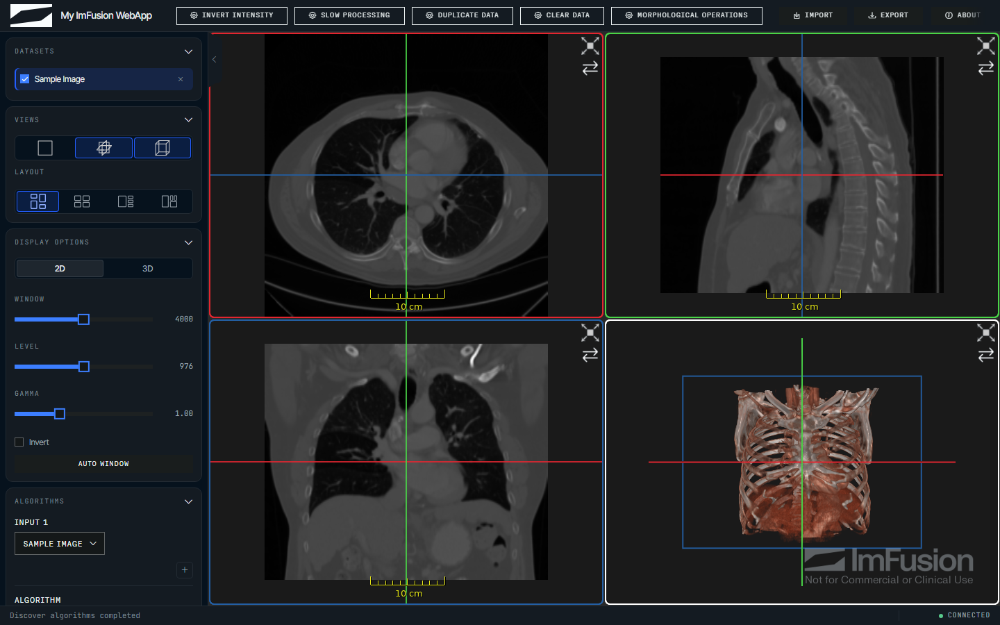

# ImFusion WebAppKit

The ImFusion WebAppKit serves Python imaging algorithms in a medical web viewer
over HTTP, so you can demo them to colleagues and clinicians without writing any
web code. You register a function, the kit builds the matching button and
controls, and whatever you return shows up in the viewer.

!!! note

    This is an early prototype, so interfaces
    may still change between versions. The kit itself is MIT-licensed, but it
    runs on the ImFusion SDK, which is free for non-commercial use and needs a
    commercial licence otherwise.



```python
import numpy as np
import imfusion

from imfusion_webappkit import FloatParameter, ImFusionWebApp

app = ImFusionWebApp(title="Image Tools")


@app.register(
    "Threshold",
    parameters=[
        FloatParameter(
            "threshold", default=100.0, minimum=0.0, maximum=1000.0,
        ),
    ],
)
def apply_threshold(
    imageset: imfusion.SharedImageSet,
    *,
    threshold: float,
) -> imfusion.SharedImageSet:
    image = imageset[0]
    label = imfusion.SharedImage((image.numpy() >= threshold).astype(np.uint8))
    label.image_to_world_matrix = image.image_to_world_matrix
    label.spacing = image.spacing

    mask = imfusion.SharedImageSet()
    mask.add(label)
    mask.modality = imfusion.Data.Modality.LABEL
    return mask


app.run()
```

Open <http://127.0.0.1:8000>, load an image, select it, and run the action.

[Get started](getting-started.md){ .md-button .md-button--primary }
[Browse the API](api/application.md){ .md-button }

## Where to go next

- [Getting started](getting-started.md) runs the bundled demo and scaffolds a
  project.
- [Command-line setup](cli.md) covers `doctor`, `demo`, `init`, and `record`.
- [Actions and algorithms](guides/actions-and-algorithms.md) explains
  callbacks, named inputs, and algorithm controls.
- [Data model synchronization](guides/data-model.md) describes per-session data
  and browser synchronization.
- [Guided workflows](guides/workflows.md) covers multi-step applications.
- [User annotations](guides/annotations.md) covers points, lines, boxes, and
  angles drawn in the viewer.
- [Branding, themes, and layout](guides/customization.md) covers the browser UI.
- [Recorded static demos](guides/static-demos.md) explains how to publish an
  application as plain files, with no Python behind it.
- Complete runnable applications are available in `imfusion_webappkit/examples`.
